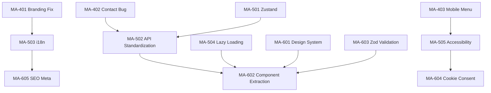

# User Stories — Frontend Improvement

> **Source**: [Frontend Improvement Analysis](../technical/FRONTEND_IMPROVEMENT_ANALYSIS.md)  
> **Priority**: 🔴 Critical → 🟠 Major → 🟡 Minor → 🟢 Enhancement  
> **Total**: 15 stories | 60 story points  
> **Timeline**: Sprint Imediat + Sprint 1 + Sprint 2

---

## 📊 Epic Mapping & Story Overview

### Epic MA-400: Quick Fixes — Branding & Bugs
**Goal**: Corectarea imediată a brandingului, bugurilor UX și navigare  
**Sprint**: Imediat (1-2 zile)

| Story ID | Title | Points | Priority | Status |
|----------|-------|--------|----------|--------|
| MA-401 | Replace InsurePro branding cu ManAdviser | 3 | P0 🔴 | 🔄 Ready |
| MA-402 | Fix Contact form fake success bug | 1 | P0 🔴 | 🔄 Ready |
| MA-403 | Fix mobile menu close on navigation | 1 | P0 🔴 | 🔄 Ready |
| MA-404 | Fix Home category navigation to Products | 2 | P1 🟠 | 🔄 Ready |
| MA-405 | Fix category display — respectă limba curentă | 1 | P1 🟠 | 🔄 Ready |

### Epic MA-500: Structural — Arhitectură & Calitate
**Goal**: Restructurare fundamentală: state management, API, i18n, lazy loading, a11y  
**Sprint**: Sprint 1 (3-5 zile)

| Story ID | Title | Points | Priority | Status |
|----------|-------|--------|----------|--------|
| MA-501 | Implementare zustand authStore | 5 | P0 🔴 | 🔄 Ready |
| MA-502 | Standardizare API calls pe api service | 5 | P0 🔴 | 🔄 Ready |
| MA-503 | Traducere stringuri hardcoded (i18n) | 5 | P1 🟠 | 🔄 Ready |
| MA-504 | Lazy loading cu React.lazy + Suspense | 3 | P1 🟠 | 🔄 Ready |
| MA-505 | ARIA accessibility — conformitate de bază | 5 | P1 🟠 | 🔄 Ready |

### Epic MA-600: Enhancement — Design, Validare & SEO
**Goal**: Polish final: design system, validare robustă, GDPR, SEO  
**Sprint**: Sprint 2 (1 săptămână)

| Story ID | Title | Points | Priority | Status |
|----------|-------|--------|----------|--------|
| MA-601 | Expansiune Design System Tailwind | 5 | P2 🟡 | 🔄 Ready |
| MA-602 | Component extraction din pagini monolitice | 8 | P2 🟡 | 🔄 Ready |
| MA-603 | Integrare Zod validation pe formulare | 5 | P2 🟡 | 🔄 Ready |
| MA-604 | Cookie Consent Banner (GDPR) | 3 | P1 🟠 | 🔄 Ready |
| MA-605 | SEO meta tags cu react-helmet-async | 3 | P2 🟡 | 🔄 Ready |

---

## 🎯 Sprint Imediat — Quick Fixes

---

### **MA-401: Replace InsurePro Branding cu ManAdviser**
**Epic**: MA-400 Quick Fixes | **Points**: 3 | **Priority**: P0 🔴

#### User Story
**As a** potential client visiting ManAdviser  
**I want** to see correct ManAdviser + Allianz Țiriac branding across the entire site  
**So that** I have confidence I'm working with the right intermediary and not a generic/unknown company

#### Background
Frontend-ul conține 15+ referințe la „InsurePro" — un brand placeholder generic — în Navbar, Footer, i18n files, și contact info. Include și menționarea „reasigurare" deși ManAdviser este exclusiv intermediar de asigurări.

#### Acceptance Criteria

**AC1: Navbar branding**
- **GIVEN** orice pagină a site-ului
- **WHEN** utilizatorul vede logo-ul din header
- **THEN** alt text-ul este `"ManAdviser Logo"` (nu InsurePro)

**AC2: Footer branding**
- **GIVEN** footer-ul site-ului
- **WHEN** utilizatorul scrollează la footer
- **THEN** heading-ul arată `"ManAdviser"` nu `"InsurePro"`
- **AND** descrierea este `"Intermediar exclusiv Allianz Țiriac"` (fără „reasigurare")
- **AND** email-ul de contact este `contact@manadviser.ro`
- **AND** adresa este cea reală a ManAdviser
- **AND** copyright arată `© 2026 ManAdviser`

**AC3: Translations RO/EN**
- **GIVEN** fișierele `ro.json` și `en.json`
- **WHEN** se verifică textele „About" section
- **THEN** zero referințe la „InsurePro" în nicio cheie de traducere
- **AND** hero subtitle nu menționează „reasigurare" / „reinsurance"
- **AND** email contact este `contact@manadviser.ro` în ambele limbi
- **AND** history text menționează ManAdviser + Allianz Țiriac

#### Fișiere afectate
- `components/common/Navbar.jsx` — L44
- `components/common/Footer.jsx` — L14, L15, L53, L55, L63
- `i18n/ro.json` — `home.hero.subtitle`, `about.historyText1`, `about.historyText2`, `contact.emailAddress`
- `i18n/en.json` — aceleași chei

#### Definition of Done
- [ ] Zero apariții „InsurePro" în întreaga bază de cod frontend
- [ ] Zero menționări „reasigurare" / „reinsurance"
- [ ] Email, adresă, telefon actualizate cu date reale ManAdviser
- [ ] Verificat în ambele limbi (RO/EN)

---

### **MA-402: Fix Contact Form Fake Success Bug**
**Epic**: MA-400 Quick Fixes | **Points**: 1 | **Priority**: P0 🔴

#### User Story
**As a** user submitting a contact form  
**I want** to receive honest feedback about my submission status  
**So that** I know whether my message was actually received or if I need to try again

#### Background
`Contact.jsx` arată `toast.success()` even when the API call fails, immediately after showing `toast.error()`. Utilizatorul vede rapid un mesaj de eroare urmat de unul de succes — confusing and misleading.

#### Acceptance Criteria

**AC1: Error handling corect**
- **GIVEN** API-ul de contact nu este disponibil
- **WHEN** utilizatorul trimite formularul
- **THEN** se arată DOAR mesajul de eroare `toast.error()`
- **AND** formularul NU se resetează (datele utilizatorului se păstrează)
- **AND** NU apare niciun `toast.success()`

**AC2: Success handling corect**
- **GIVEN** API-ul funcționează
- **WHEN** utilizatorul trimite formularul cu succes
- **THEN** se arată DOAR `toast.success()`
- **AND** formularul se resetează

#### Fișier afectat
- `pages/Contact.jsx` — L20-27: remove mock submission din catch block

#### Definition of Done
- [ ] Catch block arată doar eroare, fără mock success
- [ ] Formularul nu se resetează la eroare
- [ ] Testat manual cu API on/off

---

### **MA-403: Fix Mobile Menu Close on Navigation**
**Epic**: MA-400 Quick Fixes | **Points**: 1 | **Priority**: P0 🔴

#### User Story
**As a** mobile user navigating ManAdviser  
**I want** the mobile menu to close automatically when I tap a link  
**So that** I can see the page content immediately without manually closing the menu

#### Background
Mobile menu-ul rămâne deschis după click pe un link. Utilizatorul trebuie să apese manual hamburger-ul pentru a-l închide.

#### Acceptance Criteria

**AC1: Auto-close**
- **GIVEN** mobile menu-ul este deschis
- **WHEN** utilizatorul apasă pe orice link din meniu
- **THEN** meniul se închide imediat
- **AND** navigarea se efectuează normal

**AC2: Smooth transition**
- **GIVEN** auto-close este implementat
- **WHEN** meniul se închide
- **THEN** tranziția este fluidă (nu jump abrupt)

#### Fișier afectat
- `components/common/Navbar.jsx` — adaugă `onClick={() => setMobileOpen(false)}` pe fiecare `<Link>` din mobile menu

#### Definition of Done
- [ ] Toate linkurile din mobile menu au `onClick` close handler
- [ ] Testat pe mobile viewport (< 768px)
- [ ] Admin link-urile din mobile menu incluse

---

### **MA-404: Fix Home Category Navigation to Products**
**Epic**: MA-400 Quick Fixes | **Points**: 2 | **Priority**: P1 🟠

#### User Story
**As a** potential client browsing insurance categories on the homepage  
**I want** clicking a category to take me to Products pre-filtered by that category  
**So that** I see relevant policies immediately instead of the full unfiltered catalog

#### Background
Homepage categories use `navigate('/products')` fără a transmite parametrul de categorie. Products page suportă deja `?category=` query param dar nu primește valoarea din Home.

#### Acceptance Criteria

**AC1: Category param passed**
- **GIVEN** homepage-ul cu 6 category cards
- **WHEN** utilizatorul face click pe „Asigurări Auto"
- **THEN** este redirecționat la `/products?category=auto`
- **AND** Products page arată doar polițele din categoria Auto

**AC2: All categories mapped**
- **GIVEN** cele 6 categorii (auto, home, life, health, travel, business)
- **WHEN** se face click pe fiecare
- **THEN** query param corespunde mapării din Products.jsx `categoryMap`

#### Fișier afectat
- `pages/Home.jsx` — L110: schimbă `navigate('/products')` → `navigate(\`/products?category=${categoryKey}\`)`

#### Definition of Done
- [ ] Click pe fiecare categorie din Home duce la Products filtrat
- [ ] Filtrarea se aplică corect pe Products page
- [ ] Back button funcționează corect (browser history)

---

### **MA-405: Fix Category Display — Respectă Limba Curentă**
**Epic**: MA-400 Quick Fixes | **Points**: 1 | **Priority**: P1 🟠

#### User Story
**As a** English-speaking user on ManAdviser  
**I want** category names to display in my selected language  
**So that** I can navigate the site entirely in English without mixed-language content

#### Background
Home.jsx arată `cat.name_Ro` ca heading și `cat.name_En` ca subtitlu indiferent de limba selectată. Ar trebui să afișeze numele în limba curentă.

#### Acceptance Criteria

**AC1: Language-aware display**
- **GIVEN** utilizatorul a selectat limba EN
- **WHEN** vizualizează categoriile pe homepage
- **THEN** heading-ul arată `name_En` (e.g., „Auto Insurance")
- **AND** când e pe RO, arată `name_Ro` (e.g., „Asigurări Auto")

#### Fișier afectat
- `pages/Home.jsx` — L113-114: adaugă verificare `i18n.language`

#### Definition of Done
- [ ] Categoriile Home respectă limba curentă
- [ ] Testat prin toggle RO ↔ EN

---

## 🎯 Sprint 1 — Structural

---

### **MA-501: Implementare Zustand AuthStore**
**Epic**: MA-500 Structural | **Points**: 5 | **Priority**: P0 🔴

#### User Story
**As a** developer maintaining ManAdviser  
**I want** centralized authentication state management using zustand  
**So that** auth state is reactive, components re-render properly on login/logout, and localStorage access is not scattered through JSX

#### Background
`zustand` v4.4 este instalat în `package.json` dar nu există niciun store. Autentificarea se face prin `localStorage.getItem('token')` apelat direct în JSX renders din Navbar, AdminDashboard, și ProtectedRoute — un anti-pattern React care nu triggerează re-render la schimbări de state.

#### Acceptance Criteria

**AC1: Auth store created**
- **GIVEN** un fișier `stores/authStore.js`
- **WHEN** este importat în orice componentă
- **THEN** expune: `isAuthenticated`, `user`, `token`, `login()`, `logout()`, `checkAuth()`
- **AND** persistă starea prin `zustand/middleware` persist

**AC2: Navbar reactive**
- **GIVEN** utilizatorul se loghează în alt tab
- **WHEN** revine la tab-ul cu Navbar
- **THEN** Navbar arată corect linkul Admin/Dashboard fără refresh

**AC3: ProtectedRoute uses store**
- **GIVEN** `ProtectedRoute.jsx`
- **WHEN** verifică autentificarea
- **THEN** folosește `useAuthStore()` nu `localStorage.getItem()`

**AC4: AdminDashboard uses store**
- **GIVEN** `AdminDashboard.jsx`
- **WHEN** afișează user info și face API calls
- **THEN** obține token-ul din store, nu din `localStorage` direct

#### Fișiere afectate
- `stores/authStore.js` — NOU
- `components/common/Navbar.jsx` — replace localStorage
- `components/ProtectedRoute.jsx` — replace localStorage
- `pages/AdminDashboard.jsx` — replace localStorage
- `pages/AdminLogin.jsx` — use store login()

#### Definition of Done
- [ ] Zustand store creat cu persist middleware
- [ ] Zero apeluri `localStorage.getItem('token')` în JSX
- [ ] Login/logout triggerează re-render corect
- [ ] ProtectedRoute folosește store
- [ ] AdminDashboard folosește store

---

### **MA-502: Standardizare API Calls pe Api Service**
**Epic**: MA-500 Structural | **Points**: 5 | **Priority**: P0 🔴

#### User Story
**As a** developer working on ManAdviser  
**I want** all API calls to go through the centralized `api` service  
**So that** JWT tokens are automatically attached, 401 errors are handled consistently, and request/response logging works everywhere

#### Background
Există un `services/api.js` cu interceptors (JWT, 401 redirect), dar 5 din 7 componente importă `axios` direct și construiesc manual headers. `Products.jsx` importă AMBELE.

#### Acceptance Criteria

**AC1: Single import**
- **GIVEN** orice componentă cu API calls
- **WHEN** face un request
- **THEN** folosește `import api from '../services/api'`
- **AND** nu importă `axios` direct

**AC2: No manual auth headers**
- **GIVEN** `AdminDashboard.jsx`
- **WHEN** face API calls
- **THEN** nu construiește manual `{ headers: { Authorization: ... } }`
- **AND** interceptorul din api service se ocupă automat

**AC3: Enhanced api service**
- **GIVEN** `services/api.js`
- **WHEN** este importat
- **THEN** expune metode helper: `categoriesApi`, `policiesApi`, `quotesApi`, `contactsApi`
- **AND** include response logging în development mode

#### Fișiere afectate
- `services/api.js` — enhance cu typed methods
- `pages/Home.jsx` — replace `axios` → `api`
- `pages/Products.jsx` — remove `axios`, keep `api`
- `pages/Calculator.jsx` — replace `axios` → `api`
- `pages/Contact.jsx` — replace `axios` → `api`
- `components/RCAForm.jsx` — replace `axios` → `api`
- `pages/AdminDashboard.jsx` — replace `axios` → `api`, remove manual headers

#### Definition of Done
- [ ] Zero imports `from 'axios'` în componente (doar în api.js)
- [ ] Zero construcții manuale de Authorization headers
- [ ] API service expune metode tipizate
- [ ] Dev logging funcțional
- [ ] Testat cu API on/off

---

### **MA-503: Traducere Stringuri Hardcoded (i18n)**
**Epic**: MA-500 Structural | **Points**: 5 | **Priority**: P1 🟠

#### User Story
**As a** English-speaking user on ManAdviser  
**I want** all interface text to display in my chosen language  
**So that** I can fully understand and navigate the insurance platform without encountering random Romanian text

#### Background
Calculator.jsx conține ~15 stringuri hardcoded în română, RCAForm.jsx folosește ~40 de verificări inline `i18n.language === 'ro' ? '...' : '...'` în loc de `t()`, NotFound.jsx nu are nicio traducere, și Footer.jsx are hardcoded „Companie".

#### Acceptance Criteria

**AC1: Calculator fully translated**
- **GIVEN** Calculator page
- **WHEN** limba este EN
- **THEN** toate textele sunt în engleză: subtitle, labels, placeholders, results, disclaimer
- **AND** toast messages sunt traduse

**AC2: NotFound translated**
- **GIVEN** NotFound page (404)
- **WHEN** limba este EN/RO
- **THEN** titlu, descriere, și buton sunt traduse corect
- **AND** textul „Gaseste Acasă" este corectat gramatical

**AC3: RCAForm uses t() function**
- **GIVEN** RCAForm.jsx
- **WHEN** este afișat
- **THEN** toate cele ~40 stringuri folosesc `t('rcaForm.key')` nu inline lang check
- **AND** ro.json și en.json conțin cheile corespunzătoare

**AC4: Footer translated**
- **GIVEN** footer section „Companie"
- **WHEN** limba este EN
- **THEN** arată „Company" nu „Companie"
- **AND** „Blog", „Certificări" sunt traduse

#### Fișiere afectate
- `pages/Calculator.jsx` — ~15 stringuri
- `pages/NotFound.jsx` — tot conținutul
- `components/RCAForm.jsx` — ~40 stringuri + eliminare pattern `i18n.language ===`
- `components/common/Footer.jsx` — headings
- `i18n/ro.json` — chei noi: `calculator.*`, `notFound.*`, `rcaForm.*`, `footer.*`
- `i18n/en.json` — aceleași chei noi

#### Definition of Done
- [ ] Zero stringuri hardcoded în română în Calculator/NotFound
- [ ] Zero pattern `i18n.language === 'ro' ? ... : ...` în RCAForm
- [ ] Chei i18n noi adăugate in ro.json și en.json
- [ ] Testat prin toggle RO ↔ EN pe fiecare pagină afectată

---

### **MA-504: Lazy Loading cu React.lazy + Suspense**
**Epic**: MA-500 Structural | **Points**: 3 | **Priority**: P1 🟠

#### User Story
**As a** user visiting ManAdviser  
**I want** the site to load quickly by only downloading the code for the page I'm viewing  
**So that** I don't wait for admin panel code to load when I just want to check insurance products

#### Background
`App.jsx` importă eager toate cele 12 pagini (inclusiv cele 5 admin). Un vizitator obișnuit nu are nevoie de AdminDashboard, AdminPolicies, etc.

#### Acceptance Criteria

**AC1: Admin pages lazy loaded**
- **GIVEN** un utilizator vizitează homepage-ul
- **WHEN** pagina se încarcă
- **THEN** chunk-urile admin NU sunt descărcate
- **AND** sunt descărcate doar la navigare la `/admin/*`

**AC2: Public pages lazy loaded**
- **GIVEN** paginile About, Calculator, Contact
- **WHEN** nu sunt vizitate
- **THEN** nu sunt în bundle-ul inițial

**AC3: Loading fallback**
- **GIVEN** o pagină lazy-loaded
- **WHEN** chunk-ul se descarcă
- **THEN** utilizatorul vede un loading spinner/skeleton
- **AND** tranziția la conținut este smooth

#### Fișier afectat
- `App.jsx` — replace static imports with `React.lazy()`, wrap Routes in `<Suspense>`

#### Definition of Done
- [ ] Toate paginile (minus Home) sunt lazy loaded
- [ ] Suspense fallback cu LoadingSpinner
- [ ] Verificat build output: chunk-uri separate
- [ ] No visible delay pe navigare normală

---

### **MA-505: ARIA Accessibility — Conformitate de Bază**
**Epic**: MA-500 Structural | **Points**: 5 | **Priority**: P1 🟠

#### User Story
**As a** user with disabilities navigating ManAdviser  
**I want** the website to be accessible via screen readers and keyboard navigation  
**So that** I can equally access insurance information and services

#### Background
Zero atribute ARIA în întreaga aplicație: mobile menu fără `aria-expanded`, butoane fără `aria-label`, formulare fără `fieldset/legend`, lipsă skip-to-content.

#### Acceptance Criteria

**AC1: Navbar accessibility**
- **GIVEN** Navbar pe mobile
- **WHEN** focus pe hamburger button
- **THEN** are `aria-expanded`, `aria-controls`, `aria-label`
- **AND** meniu are `role="navigation"` și `aria-label`

**AC2: Skip-to-content**
- **GIVEN** orice pagină
- **WHEN** utilizatorul apasă Tab la încărcarea paginii
- **THEN** primul element focusable este un link „Skip to main content"
- **AND** click pe el sare la `<main>` content

**AC3: Form accessibility**
- **GIVEN** Contact, Calculator, RCA forms
- **WHEN** navigate cu screen reader
- **THEN** grupuri de fielduri au `<fieldset>` + `<legend>`
- **AND** error messages au `aria-live="polite"`
- **AND** inputs au `aria-invalid` când validarea eșuează

**AC4: Icon accessibility**
- **GIVEN** iconuri FontAwesome
- **WHEN** sunt decorative
- **THEN** au `aria-hidden="true"`
- **AND** butonul parent are `aria-label` descriptiv

#### Fișiere afectate
- `App.jsx` — add SkipToContent component
- `components/common/Navbar.jsx` — aria attributes pe mobile menu
- `pages/Contact.jsx` — fieldset/legend, aria-live
- `pages/Calculator.jsx` — fieldset/legend, aria-live
- `components/RCAForm.jsx` — fieldset/legend per step
- Toate componentele cu FontAwesome — aria-hidden

#### Definition of Done
- [ ] Navbar mobile: aria-expanded, aria-controls, aria-label
- [ ] Skip-to-content link funcțional
- [ ] Forms: fieldset, legend, aria-live, aria-invalid
- [ ] Icons: aria-hidden pe decorative icons
- [ ] Lighthouse Accessibility score ≥ 85

---

## 🎯 Sprint 2 — Enhancement

---

### **MA-601: Expansiune Design System Tailwind**
**Epic**: MA-600 Enhancement | **Points**: 5 | **Priority**: P2 🟡

#### User Story
**As a** developer building new features for ManAdviser  
**I want** a comprehensive design system with color scales, typography, spacing, and component tokens  
**So that** new UI elements are visually consistent without guessing color values or font sizes

#### Background
`tailwind.config.js` definește doar 5 culori flat. Nu există shade-uri (primary-50...900), tipografie, border-radius tokens, shadow scale. CSS global `button:hover` se aplică pe ALL buttons.

#### Acceptance Criteria

**AC1: Color scales**
- **GIVEN** tailwind.config.js
- **WHEN** developer folosește `bg-primary-100` sau `text-primary-700`
- **THEN** shade-urile sunt disponibile (50-900) pentru primary, accent, allianz

**AC2: Typography tokens**
- **GIVEN** design system
- **WHEN** developer scrie heading
- **THEN** folosește `font-heading` (Poppins) sau `font-body` (Inter)
- **AND** custom fontSize `hero`, `section` sunt disponibile

**AC3: Global CSS cleanup**
- **GIVEN** globals.css
- **WHEN** un `<button>` este folosit într-un formular
- **THEN** NU face hover lift animation
- **AND** doar butoanele cu class `.btn-lift` au efectul

**AC4: CSS variables deduplication**
- **GIVEN** project-wide color definitions
- **WHEN** culorile sunt definite
- **THEN** single source of truth: fie CSS vars, fie tailwind (nu ambele)

#### Fișiere afectate
- `tailwind.config.js` — expand fully
- `styles/globals.css` — cleanup global selectors, remove duplicate vars

#### Definition of Done
- [ ] Color scales primary/accent 50-900
- [ ] Allianz Țiriac brand colors defined
- [ ] Typography system cu heading + body fonts
- [ ] Global button hover removed, replaced cu utility class
- [ ] No duplicate color definitions

---

### **MA-602: Component Extraction din Pagini Monolitice**
**Epic**: MA-600 Enhancement | **Points**: 8 | **Priority**: P2 🟡

#### User Story
**As a** developer maintaining ManAdviser  
**I want** large page components broken into smaller, reusable pieces  
**So that** code is easier to maintain, test, and reuse across different pages

#### Background
Home.jsx = 165 linii, Products.jsx = 431 linii, RCAForm.jsx = 571 linii. Toate conțin logica de fetch, rendering, state management, și form handling într-un singur fișier. Directoarele `components/home/`, `components/products/`, etc. sunt goale.

#### Acceptance Criteria

**AC1: Home page decomposed**
- **GIVEN** `pages/Home.jsx`
- **WHEN** este refactored
- **THEN** are sub-componente: `HeroSection`, `FeaturesGrid`, `CategoriesPreview`, `TestimonialsCarousel`, `CTABanner`
- **AND** fiecare sub-componentă este în `components/home/`

**AC2: Products page decomposed**
- **GIVEN** `pages/Products.jsx` (431 linii)
- **WHEN** este refactored
- **THEN** are sub-componente: `CategoryFilter`, `PolicyCard`, `QuoteFormModal`
- **AND** fiecare este în `components/products/`

**AC3: Common components created**
- **GIVEN** pattern-uri repetate (hero sections, loading states)
- **WHEN** sunt identificate
- **THEN** `LoadingSpinner`, `EmptyState`, `ErrorBoundary`, `HeroSection` sunt componente comune reutilizabile

**AC4: Custom hooks extracted**
- **GIVEN** logica de API fetch repetată
- **WHEN** este extrasă
- **THEN** `hooks/useApi.js` și `hooks/useAuth.js` sunt create
- **AND** componente le folosesc

#### Fișiere afectate
- `pages/Home.jsx` → componente în `components/home/`
- `pages/Products.jsx` → componente în `components/products/`
- `components/common/LoadingSpinner.jsx` — NOU
- `components/common/EmptyState.jsx` — NOU
- `components/common/ErrorBoundary.jsx` — NOU
- `hooks/useApi.js` — NOU
- `hooks/useAuth.js` — NOU

#### Definition of Done
- [ ] Home.jsx < 50 linii (orchestration only)
- [ ] Products.jsx < 80 linii
- [ ] 5+ sub-componente create și populate directories goale
- [ ] 2+ custom hooks create
- [ ] Zero regressions funcționale
- [ ] App funcționează identic vizual

---

### **MA-603: Integrare Zod Validation pe Formulare**
**Epic**: MA-600 Enhancement | **Points**: 5 | **Priority**: P2 🟡

#### User Story
**As a** user filling insurance forms  
**I want** immediate, clear validation feedback specific to Romanian data formats  
**So that** I submit correct information the first time (valid phone, CNP, plate number, etc.)

#### Background
`zod` v3.22 și `@hookform/resolvers` sunt instalate dar neutilizate. Formularele folosesc doar `required: true` HTML5 fără formatare sau regex checks.

#### Acceptance Criteria

**AC1: Contact form validation**
- **GIVEN** Contact form
- **WHEN** utilizatorul introduce date
- **THEN** email format validat cu mesaj specific
- **AND** telefon validat cu regex românesc `+40 7XX XXX XXX`
- **AND** mesajul minim 10 caractere

**AC2: RCA form validation**
- **GIVEN** RCAForm
- **WHEN** utilizatorul introduce CNP
- **THEN** validare lungime 13 cifre + checksum
- **AND** nr. înmatriculare validat (format `XX-NN-XXX`)
- **AND** VIN validat (17 caractere alfanumeric)

**AC3: Calculator form validation**
- **GIVEN** Calculator form
- **WHEN** utilizatorul selectează politată
- **THEN** zod schema validează policy selection, email, fullName, phone

**AC4: User-friendly error messages**
- **GIVEN** validare eșuează
- **WHEN** eroarea se afișează
- **THEN** mesajele sunt traduse (RO/EN) și specifice

#### Fișiere afectate
- `utils/schemas.js` — NOU: Zod schemas per formular
- `pages/Contact.jsx` — adaugă `zodResolver`
- `pages/Calculator.jsx` — adaugă `zodResolver`
- `components/RCAForm.jsx` — adaugă `zodResolver`
- `i18n/ro.json` + `en.json` — chei erori validare

#### Definition of Done
- [ ] Zod schemas create pentru Contact, Calculator, RCA
- [ ] zodResolver configurat pe fiecare formular
- [ ] Validare telefon format românesc
- [ ] Validare CNP (opțional checksum)
- [ ] Mesaje erori traduse RO/EN
- [ ] Formulare nu pot fi trimise cu date invalide

---

### **MA-604: Cookie Consent Banner (GDPR)**
**Epic**: MA-600 Enhancement | **Points**: 3 | **Priority**: P1 🟠

#### User Story
**As a** user visiting ManAdviser for the first time  
**I want** to be informed about and control which cookies are used  
**So that** my data privacy is respected in accordance with GDPR and Romanian data protection law

#### Background
Zero cookie consent mechanism. GDPR și legislația română (Legea 506/2004) impun informarea și consimțământul utilizatorului pentru cookies non-esențiale.

#### Acceptance Criteria

**AC1: Banner display**
- **GIVEN** un vizitator nou (fără cookie consent salvat)
- **WHEN** accesează orice pagină
- **THEN** vede un banner cookie consent la baza ecranului
- **AND** banner-ul este în limba selectată (RO/EN)

**AC2: Cookie categories**
- **GIVEN** cookie consent banner
- **WHEN** utilizatorul examinează opțiunile
- **THEN** vede 3 categorii:
  - Esențiale (always on, gri, disabled)
  - Analitice (toggle, default off)
  - Marketing (toggle, default off)

**AC3: Consent persistence**
- **GIVEN** utilizatorul acceptă/declină cookies
- **WHEN** revine pe site
- **THEN** preferințele sunt respectate fără a arăta banner-ul din nou

**AC4: Link to Privacy Policy**
- **GIVEN** banner-ul de consent
- **WHEN** este afișat
- **THEN** include link către pagina Privacy Policy

#### Fișiere afectate
- `components/common/CookieConsent.jsx` — NOU
- `App.jsx` — include CookieConsent component
- `i18n/ro.json` + `en.json` — chei `cookies.*`

#### Definition of Done
- [ ] Banner afișat la prima vizită
- [ ] 3 categorii de cookies cu toggles
- [ ] Preferințe salvate persistent
- [ ] Link Privacy Policy funcțional
- [ ] Banner tradus RO/EN
- [ ] Nu blochează navigarea

---

### **MA-605: SEO Meta Tags cu react-helmet-async**
**Epic**: MA-600 Enhancement | **Points**: 3 | **Priority**: P2 🟡

#### User Story
**As a** business stakeholder wanting ManAdviser to rank on Google  
**I want** each page to have unique, relevant meta titles and descriptions  
**So that** search engines properly index our insurance products and the site appears attractively in search results

#### Background
Zero meta tags management. Toate paginile au același `<title>` static din `index.html`. Fără Open Graph tags (sharing pe social media arată generic).

#### Acceptance Criteria

**AC1: Dynamic titles**
- **GIVEN** fiecare pagină publică
- **WHEN** este vizitată
- **THEN** `<title>` este unic: e.g., „Produse Asigurare | ManAdviser" sau „Contact | ManAdviser"

**AC2: Meta descriptions**
- **GIVEN** fiecare pagină
- **WHEN** crawled de Google
- **THEN** are `<meta name="description">` unic, 150-160 caractere, cu keywords relevante

**AC3: Open Graph tags**
- **GIVEN** un utilizator share pe Facebook/LinkedIn
- **WHEN** link-ul este previzualizat
- **THEN** arată: imagine ManAdviser, titlu corect, descriere relevantă

**AC4: Language-aware meta**
- **GIVEN** pagina în limba EN
- **WHEN** meta tags sunt generali
- **THEN** sunt în engleză + `<html lang="en">`
- **AND** pe RO: `<html lang="ro">`

#### Fișiere afectate
- `package.json` — add `react-helmet-async`
- `App.jsx` — wrap în `<HelmetProvider>`
- Fiecare pagină — add `<Helmet>` cu title + meta

#### Definition of Done
- [ ] react-helmet-async instalat și configurat
- [ ] Titlu unic per pagină (6 pagini publice)
- [ ] Meta description per pagină
- [ ] Open Graph tags pe homepage minim
- [ ] Lang attribute dinamic pe `<html>`

---

## 🔗 Dependencies & Ordering

### Critical Path
**MA-401** → **MA-501** → **MA-502** → **MA-503** → **MA-602**

### Parallel Tracks
- Track A: MA-401 → MA-503 → MA-605
- Track B: MA-402 + MA-403 → MA-501 → MA-502
- Track C: MA-404 + MA-405 (independent)
- Track D: MA-504 + MA-505 (independent)

---

## 📊 Velocity Summary

| Sprint | Stories | Points | Duration |
|--------|---------|--------|----------|
| **Imediat** | MA-401..405 | 8 pts | 1-2 zile |
| **Sprint 1** | MA-501..505 | 23 pts | 3-5 zile |
| **Sprint 2** | MA-601..605 | 24 pts | 5-7 zile |
| **TOTAL** | 15 stories | **55 pts** | ~2-3 săptămâni |

---

*Next Action: Begin Sprint Imediat with MA-401 (Branding Fix) — estimated 2-3 ore*